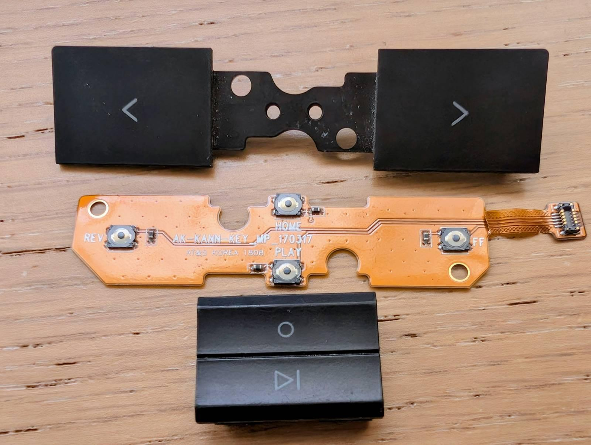

# Astell Kern KANN button flex PCB Reverse Engineering effort

I managed to break my AK buttons while dissasembling it.  
So I challenged myself to Reverse Engineer the button flex PCB myself.  
It's my first time doing flexible PCB's.

